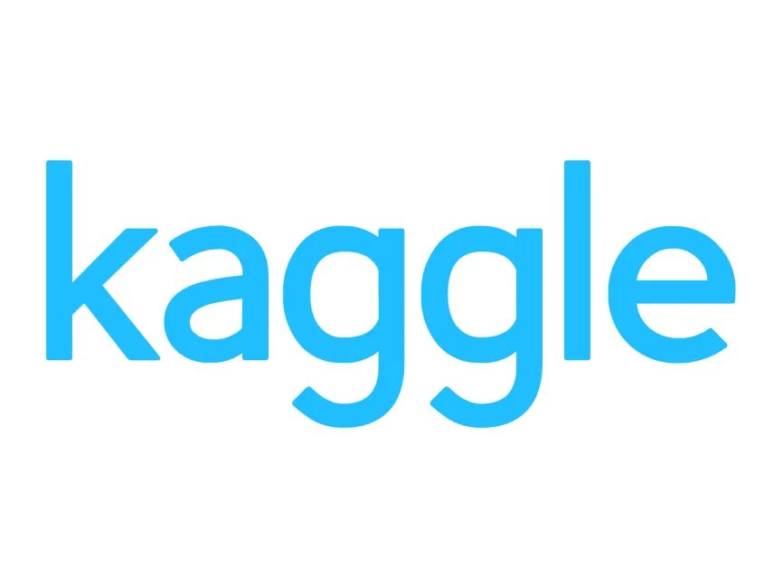

# Hey there! I am Sahad

<aside>
 [LinkedIn](www.linkedin.com/in/sahad-m-647314309)

</aside>

<aside>
 [GitHub](https://github.com/SahadStats)

</aside>

<aside>
 [Kaggle](https://www.kaggle.com/shaedsets)

</aside>

## Business| Data Analyst

I’m **Sahad**, a passionate **Business and Data Analyst** with a Bachelor’s degree in Commerce. I specialize in using tools like **Excel, Tableau, MySQL, and Power BI** to analyze complex data, create interactive dashboards, and generate meaningful insights.

 With hands-on experience from various projects, I love turning data into actionable solutions that drive business success. I’m excited to share my work and look forward to applying my skills to real-world challenges.

## Case Study Gallery

[Case Studies](Case%20Studies%2012af5859f92081eda434eed87f8dd84d.csv)

---

## Skills

[Skills](Skills%2012af5859f9208169a317ed052288ce0d.csv)

---

## Contact

<aside>
 [LinkedIn](www.linkedin.com/in/sahad-m-647314309)

</aside>

<aside>
 [GitHub](https://github.com/SahadStats)

</aside>

<aside>
 [Kaggle](https://www.kaggle.com/shaedsets)

</aside>

<aside>
 [Instagram](https://www.instagram.com/_shaed._/?__pwa=1)

</aside>

---